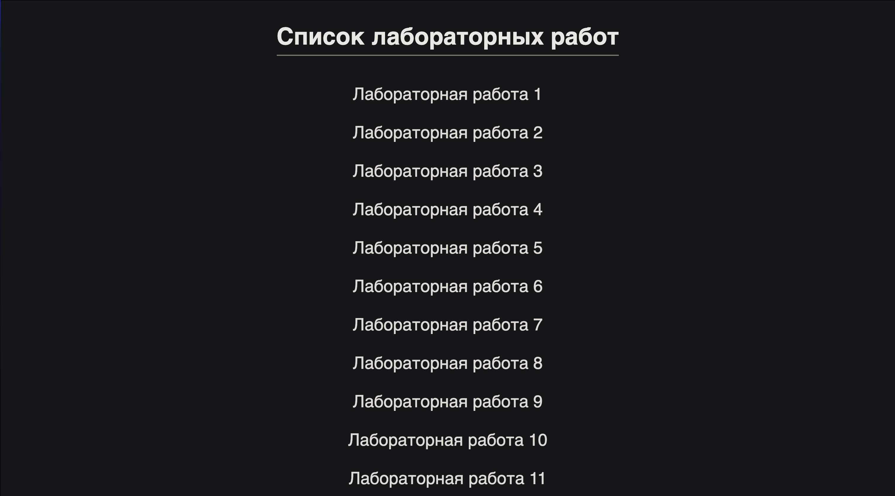
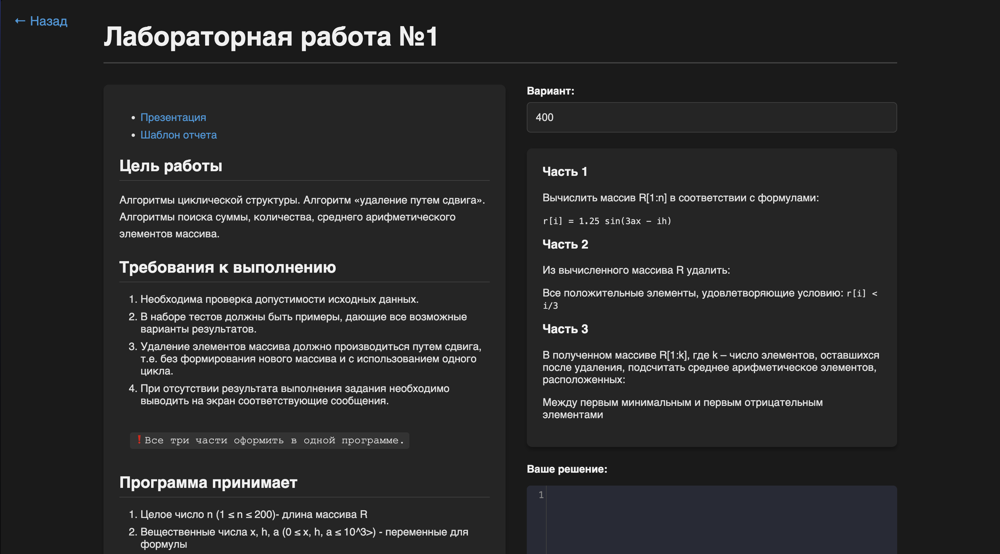
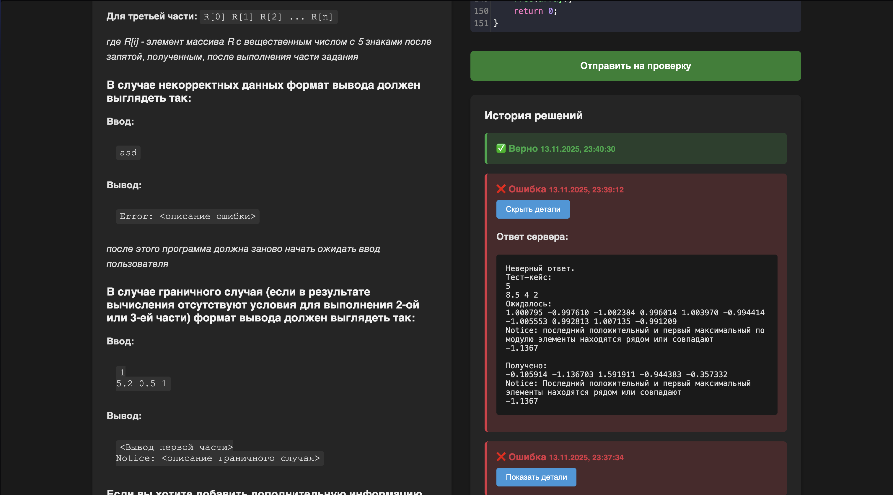

# laboratory-works-checker

## О проекте
Проект представляет собой сервер для проверки лабораторных работ по направлению "Алгоритмизация и программирование" первого курса ИВТ ВШЭ. 

**Важно:** Тесты, эталонные решения а также описания лабораторных работ не готовы, в проекте присутствуют только частично законченные папки лабораторных работ №1 и №2, которые использовались для тестирования

## Используемые технологии
- Golang
- JS/CSS/HTML
- JSON
- Python
- REST API
- TLS/SSL
- Docker & Docker Compose

## Структура проекта
```
.
├── README.md
├── apps
│   ├── backend
│   │   ├── application
│   │   │   ├── checker
│   │   │   │   ├── checker.go
│   │   │   │   ├── monolit.go
│   │   │   │   ├── splited.go
│   │   │   │   └── validator.go
│   │   │   ├── cleaner
│   │   │   │   └── cleaner.go
│   │   │   ├── config
│   │   │   │   └── config.go
│   │   │   ├── http-server
│   │   │   │   ├── handlers.go
│   │   │   │   ├── middlewares.go
│   │   │   │   └── server.go
│   │   │   └── models
│   │   │       └── models.go
│   │   └── cmd
│   │       └── cmd.go
│   └── frontend
│       ├── index.html
│       ├── lab.html
│       ├── script.js
│       └── styles.css
├── labs
│   ├── lab1
│   ...
├── nginx.conf
├── Dockerfile
├── docker-compose.yml
└── go.mod
```

## Требования
Перед запуском убедитесь, что у вас установлено:
### Вариант с Docker (рекомендуется)
- **Docker** версия 24.0 или выше  
  [Скачать Docker](https://www.docker.com/get-started)
- **Docker Compose** (обычно входит в Docker)
### Вариант без Docker

- **Go** версия 1.20+  
  [Скачать Go](https://golang.org/dl/)
- **Интерпретатор Python**  
  [Скачать интерпретатор Python](https://www.python.org/downloads/)


## Установка и запуск проекта
### Установка
1. Клонируйте репозиторий
```sh
git clone https://github.com/vedsatt/laboratory-works-checker.git
cd ./laboratory-works-checker
```
Установите зависимости
```sh
go mod tidy
```
### Запуск
1. **Укажите переменные среды (легче всего через Docker)**:
```sh
PORT=<ЗНАЧЕНИЕ>
HTTPS_PORT=<ЗНАЧЕНИЕ>
HOST_URL=<ЗНАЧЕНИЕ> // "localhost" без Docker; "backend" с Docker
```
2. **В случае, если вы хотите использовать SSL/TLS, создайте файлы ```cert.pem```, ```key.pem``` и добавьте туда сертификат и ключ соответственно**  
**Примечание:** если не создать файл и/или не указать определенные значения, то программа установит неуказанные значения по умолчанию (для адреса подключения к оркестратору будет установлено значение для локального подключения)

### С помощью Go:
1. **Загрузите файлы frontend на сервер**

2. **Запустите backend-сервер:**
```sh
go run apps/backend/cmd/cmd.go
```

### С помощью Docker:
**Разверните контейнеры с помощью docker-compose:**
```sh
docker-compose up --build
```

## Дизайн системы
В коде подробна расписана каждая функция backend-а.
Чтобы посмотреть структурированную документацию:
1. Установите godoc:
```bash
go install golang.org/x/tools/cmd/godoc@latest
```
2. Запустите локальный сайт с документацией:
```bash
godoc -http=:6060
```
3. Перейдите на этот сайт: http://localhost:6060/pkg/github.com/vedsatt/laboratory-works-checker

## Добавление лабораторных работ
У каждой лабораторной работы существует файлы ```config.json``` и ```description.md```. Чтобы программа работала корректно, заполните эти файлы в папке лабораторной работы  
Структура файла ```config.json``` (пример взят из лабораторной работы №1):
```json
{
    "language": "c", // язык, используемый в лабораторной работе (поддерживается c/c++)
    "type": "monolit", // тип лабораторной работы, "monolit" - каждая часть является подпрограммой; "splited" - каждая часть является отдельной программой
    "tasks-count": 3, // количество частей в лабораторной работе
    "test-cases": [
        "5\n8.5 4.0 2.0",
        "3\n0.0 0.0 0.0",
        "1\n10.0 1.0 1.0",
        "6\n5.0 2.0 1.0",
        "0\n3\n5.0 2.0 1.0",
        "0\n3\n5.0 2.0 1.0",
        "10\n3.14 1.57 0.5"
    ] // тест-кейсы для лабораторной работы, которые будут вводиться программой в код ученика. тест-кейсы используются только в случае "monolit"
}
```
У каждой лабораторной работы есть четкая структура директорий (пример папки для работы №1)
```
lab1
├── config.json // конфигурация
├── description.md // описание
├── task1 // часть с порядковым номером
│   ├── var1 // вариация части
│   │   └── solution.py // эталонное решение на питоне или тест-кейсы в зависимости от типа
│   ├── var2
│   │   └── solution.py
│   ├── var3
│   │   └── solution.py
│   ├── var5
│   │   └── solution.py
│   ...    
└── task2
    ├── var1
    │   └── solution.py
    ├── var2
    │   └── solution.py
    ├── var3
    │   └── solution.py
    ├── var8
    │   └── solution.py
    ...
...
```
**Эталонное решение должно быть совместимым с любым решением из других частей конкретной лаборатоной работы на питоне, а также должно строго следовать шаблону ввода/вывода.**

В зависимости от типа лабораторной работы, в ней будут отличаться файлы в папках ```var<№>```

для **monolit**:  
эталонные решения ```solution.py``` на питоне  
для **splited**:  
тест-кейсы ```tests.json``` для конкретной части и вариации  

пример тест-кейсов (из ```lab2/task1/var1```):
```json
{
    "test-cases": [
        {
            "input":"3 4\n1 5 -3 8\n-4 2 6 0\n7 -2 9 1\n4\n5 8 0 9",
            "output":"1 5 -3 0\n-4 2 6 0\n7 -2 0 1",
            "description": "Обычный случай"
        },
        {
            "input":"2 3\n2 -5 3\n1 4 -6\n5\n4\n2 5 3 4 6",
            "output":"2 -5 3\n1 4 -6",
            "description": "Все элементы в X"
        },
        {
            "input":"2 2\n5 -5\n5 5\n2\n5",
            "output":"0 -5\n0 5",
            "description": "Матрица с одинаковыми максимумами"
        },
        {
            "input":"qwerty",
            "output":"int required",
            "description": "Неверный ввод"
        }
    ]
}
```

## Взаимодействие

**Страница с выбором лабораторных работ**



**Страница лабораторной работы и выбор варианта**



**Отправка кода и просмотр результатов**



## Контакты
Если у вас возникли вопросы или предложения, можете написать их в issue или написать мне лично в тг  
[](https://t.me/sigmatemik52) [**Telegram**: @sigmatemik52](https://t.me/sigmatemik52)
